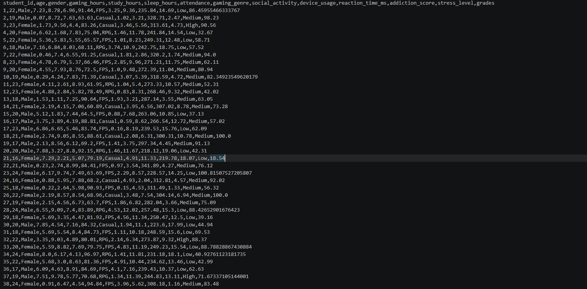
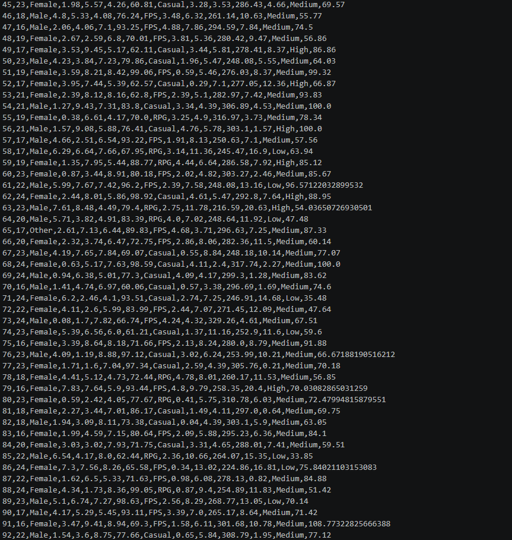
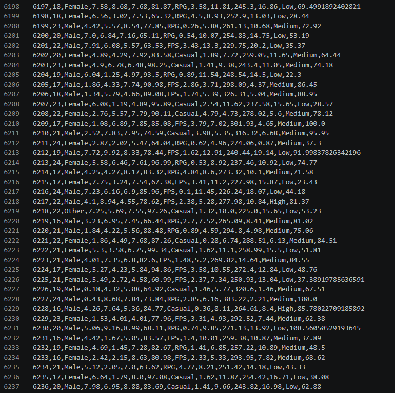

## Body

The difference between gaming and academic performance

Discuss the impact of gaming on student grades, sleep, and study habits.

This dataset explores how gaming habits affect students' academic performance.

Statistical fields: Student ID, Age, Gender, Gaming Duration, Study Duration, Sleep Duration, Attendance, Game Type, Social Activities, Device Use, Response Time (milliseconds), Addiction Score, Stress Level, Grade.

Unlike a simple dataset, this one simulates real-life behavior patterns:

-------Moderate gaming can slightly enhance cognitive performance
-------Excessive gaming negatively affects grades
-------Study time, sleep, and attendance significantly influence outcomes
-------Random noise simulates real-world variability
Features include:
-------Game Duration, Study Duration, Sleep Duration
-------Response Time (Cognitive Performance)
-------Stress Level
-------Attendance and Device Use
-------Academic Grade (Target Variable)
Use cases:
-------Predict student performance (regression model)
-------Behavioral data analysis
-------Data visualization (EDA)
-------Machine Learning projects

## Images

item_1045917995791

Here is a pay link on Stripe ( https://buy.stripe.com/3cs8yP7sY87d0vu9AB ). Please contact me lonlonago@foxmail.com after funding $89, and I will send you a complete data files , thank you!

